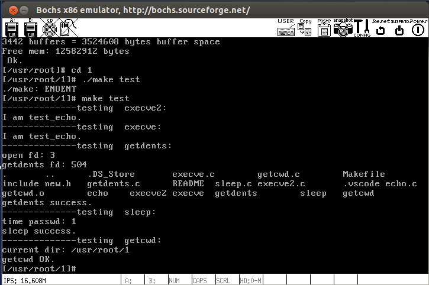
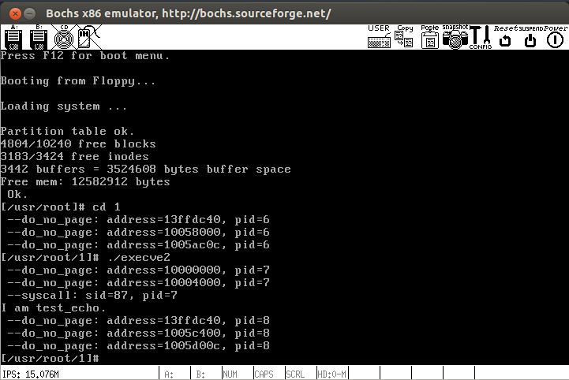
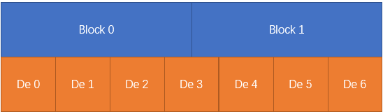
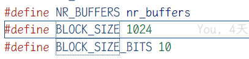
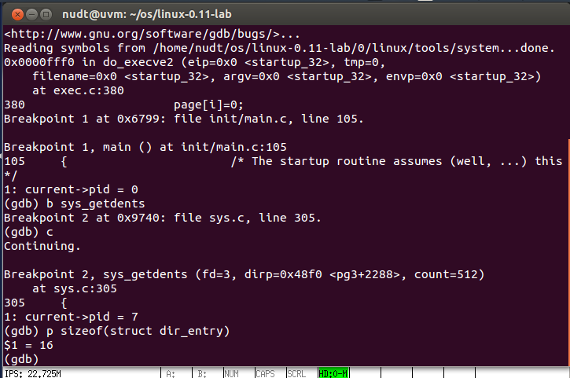
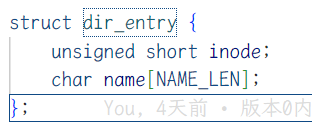
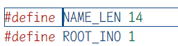

# 一、实验目的和内容

## 实验目的

深入掌握操作系统内核程序开发方法

## 实验内容

以版本0内核为基础，增加一组系统调用（如下），并通过给定的测试用例

| 序号 | 系统调用名字 | 功能                                                         |
| ---- | ------------ | ------------------------------------------------------------ |
| 1    | execve2      | 以“立即加载”的方式执行一个可执行文件，要求加载完成后运行时改进程不产生缺页异常 |
| 2    | getdents     | 获取一组目录项                                               |
| 3    | sleep        | 进程睡眠                                                     |
| 4    | getcwd       | 获取当前工作目录                                             |

要求提交实验报告和所有的源码，实验报告应记录各系统调用的设计思路、实现方法和测试过程以及画面

# 二、操作方法与实验步骤

实验的源码仓库：[TrymenT-AlphA/OS-lab (github.com)](https://github.com/TrymenT-AlphA/OS-lab)

实验中碰到的主要问题已经提交issue：[Issues · TrymenT-AlphA/OS-lab (github.com)](https://github.com/TrymenT-AlphA/OS-lab/issues)

## execve2

**思路：** 正常的execve系统调用，通过调用do_execve函数来设置对应可执行文件的代码段，数据段以及栈指针、参数和环境变量，但是并没有分配对应的页面，而是等到程序执行时自动产生缺页异常，调用do_no_page函数分配页面，因此，只需要改写do_execve2函数，在设置好所有的参数后，提前分配页面即可

```C
···
	while (i&0xfff)
		put_fs_byte(0,(char *) (i++));
	eip[0] = ex.a_entry;		/* eip, magic happens :-) */
	eip[3] = p;			/* stack pointer */

	// st
	unsigned long now_addr = current->start_code; // 起始地址
	unsigned long last_page = (current->start_code + current->brk - 1) & 0xfffff000; // 结束地址
	do {
		ck_do_no_page(now_addr); // 分配一个页面
		now_addr += 4096;
	} while (((now_addr) & 0xfffff000) <= last_page);
	// ed

	return 0;
exec_error2:
	iput(inode);
···
```

其中sys_execve2调用do_execve2的过程参考sys_execve即可

```assembly
.align 4
sys_execve2:
	lea EIP(%esp),%eax
	pushl %eax
	call do_execve2
	addl $4,%esp
	ret
```

```assembly
.globl system_call,sys_fork,timer_interrupt,sys_execve, sys_execve2 // 添加sys_execve2
```

## getdents

**思路：** 首先分析一下find_entry函数，这对于getdents和getcwd都有帮助，重要的地方已添加注释

```C
static struct buffer_head * find_entry(struct m_inode ** dir,
	const char * name, int namelen, struct dir_entry ** res_dir)
{
	···    
    // 计算目录文件记录的总dir_entry数目，方便遍历
	entries = (*dir)->i_size / (sizeof (struct dir_entry)); 
    ···
    // 遍历所有目录项
	while (i < entries) { 
		if ((char *)de >= BLOCK_SIZE+bh->b_data) {
			brelse(bh);
			bh = NULL;
            // ！！文件的存储采用了多级索引结构，此处的bmap可以将逻辑地址映射到对应块号
			if (!(block = bmap(*dir,i/DIR_ENTRIES_PER_BLOCK)) ||
			    !(bh = bread((*dir)->i_dev,block))) {
				i += DIR_ENTRIES_PER_BLOCK;
				continue;
			}
			de = (struct dir_entry *) bh->b_data; // 拿到de
		}
        // ！！执行一些判断操作，此处可以修改为我们想要的操作
		if (match(namelen,name,de)) { 
			*res_dir = de;
			return bh;
		}
		de++; // 继续
		i++;
	}
	brelse(bh);
	return NULL;
}
```

可以看到，在find_entry中已经实现了对目录项的遍历，要实现getdents函数，只要在遍历过程中将数据写入缓冲区即可，需要注意此处写入用户态的缓冲区需要用put_fs系列函数

```C
...
	while (i < entries) {
		if ((char *)de >= BLOCK_SIZE+bh->b_data) {
			brelse(bh);
			bh = NULL;
			if (!(block = bmap(*dir,i/DIR_ENTRIES_PER_BLOCK)) ||
			    !(bh = bread((*dir)->i_dev,block))) {
				i += DIR_ENTRIES_PER_BLOCK;
				continue;
			}
			de = (struct dir_entry *) bh->b_data;
		}
		// st 注意此处写入用户态缓冲区
		put_fs_long(de->inode,&buf->d_ino);
		put_fs_long(0,&buf->d_off);
		put_fs_byte(sizeof(struct linux_dirent), &buf->d_reclen);
		int j;
		for (j = 0; j < strlen(de->name); ++j)
			put_fs_byte(de->name[j], &buf->d_name[j]);
		put_fs_byte(0, &buf->d_name[j]);
		buf++;
		// ed
		de++; 
		i++;
	}
...
```

## sleep

**思路：** 利用操作系统的信号机制，首先设置一个闹钟，等待seconds秒后向当前进程发送一个SIGALRM信号，之后直接进入进程调度，这时当前进程会被挂起，直到收到信号后重新运行。注意

```C
int sys_sleep(unsigned int seconds)
{
	int ret;
	sys_signal(SIGALRM,1,NULL); // 设置信号处理函数，1默认不处理
	if ((ret = sys_alarm(seconds)) < 0) // 设置闹钟
		return -1;
	sys_pause(); // 直接进入调度
	if ((ret = sys_alarm(0)) < 0) // 复原
		return -1;
	return ret;
}
```

## getcwd

**思路：** 可以参考find_entry函数，实现寻找父目录目录项，以及寻找指定i_num的目录项

### 通过索引查找

```C
···
			de = (struct dir_entry *) bh->b_data;
		}
		// st
		if (i == index)
		{
			*res_de = de;
			return bh;
		}
		// ed
		de++, i++;
···
```

### 通过i_num查找

```c
···
    		de = (struct dir_entry *) bh->b_data;
		}
		// st
		if (de->inode == ino)
		{
			*res_de = de;
			return bh;
		}
		// ed
		de++, i++;
···
```

由于目录本身不包含自身的名字信息，因此必须首先进入到父目录，然后遍历所有目录项，找到指定i_num的目录项，进而找到目录名字

```C
long sys_getcwd(char* buf,size_t size)
{
	char _buf1[1024] = {0};
	char _buf2[1024] = {0};
	struct buffer_head * bh;
	struct dir_entry * c_de, * f_de;
	struct m_inode *c_inode = current->pwd;
	int dev, nr, block;

	int c_ino = c_inode->i_num;
	if (c_inode == current->root)
		strcpy(_buf2, "/");

	while (c_inode != current->root) {
		bh = get_de_by_index(&c_inode, 1, &f_de); // 父目录一定是索引为1的目录项
		dev = c_inode->i_dev;
		nr = f_de->inode;
		c_inode = iget(dev, nr);
		bh = get_de_by_ino(&c_inode, c_ino, &c_de); // 通过i_num查找
		c_ino = f_de->inode;
		strcpy(_buf1, "/");
		strcat(_buf1, c_de->name);
		strcat(_buf1, _buf2);
		strcpy(_buf2, _buf1);
	}
	char *p1 = _buf2, *p2 = buf;
	while (size-->0)
		put_fs_byte(*(p1++), p2++); // 写入用户缓冲区
	return buf;
}
```

# 三、实验结果与分析

所有函数调用正常



execve2中，在syscall之后，执行echo之前，也没有缺页异常



# 四、问题与建议

### 问题1

要正确实现getdents其实是一件比较麻烦的事情，首先需要实现对多级索引结构的正确遍历，即bmap函数，其次，还需要考虑数据的对齐问题，如图



但是疑惑的是find_entry中并没有考虑这样的情况，查阅之后，发现





一个块的大小1024字节，而一个dir_entry的大小为16个字节，也就是说，dir_entry和block_size刚好是对齐的，因此也就不需要考虑不对齐的情况。这也是为什么dir_entry中name的是一个14字节长的定长数组，也意味着目录名称最长只能占13个字符。




